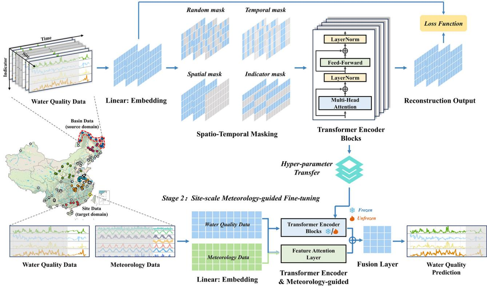
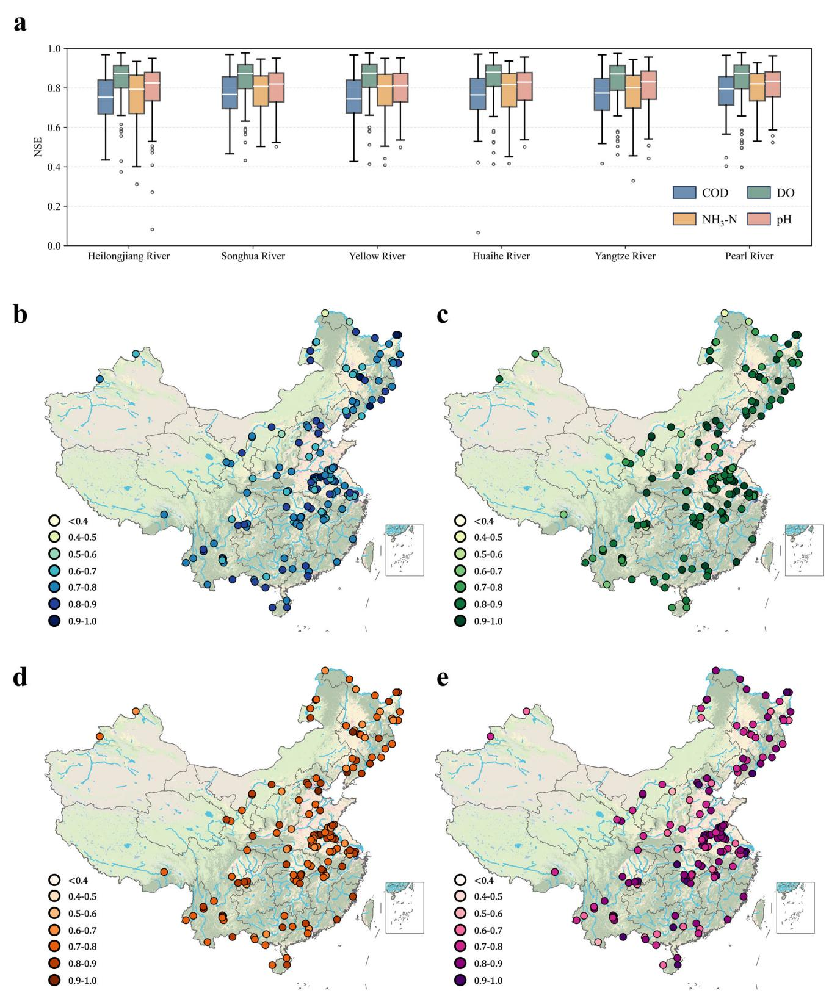
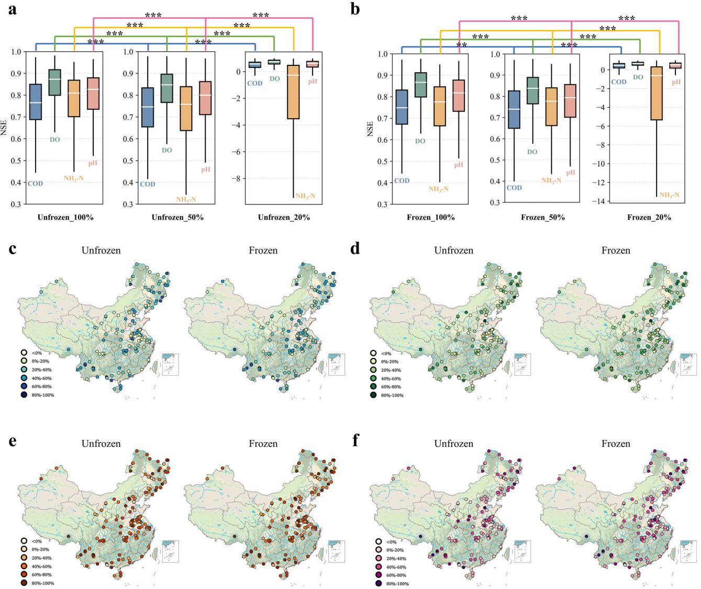
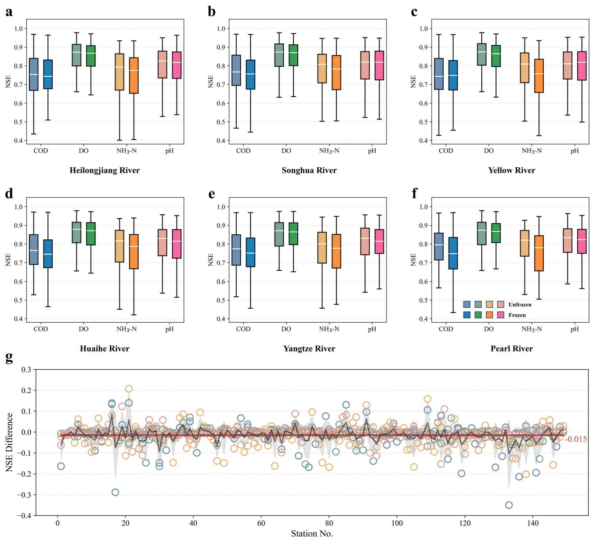
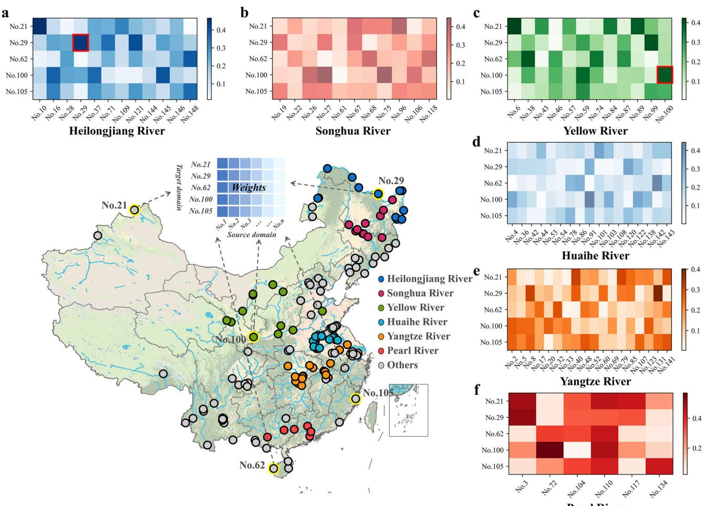

# Deep representation learning enables cross-basin water quality prediction under data-scarce conditions

Yue Zheng1,2, Xiaoran Zhang1 , Yongchao Zhou1,2 , Yiping Zhang1,2, Tuqiao Zhang1,2 & Raziyeh Farmani3

Artificial intelligence has been extensively used to predict surface water quality to assess the health of aquatic ecosystems proactively. However, water quality prediction in data-scarce conditions is a challenge, especially with heterogeneous data from monitoring sites that lack similarity in water quality, hindering the information transfer. A deep learning model is proposed that utilizes representation learning to capture knowledge from source river basins during the pre-training stage, and incorporates meteorological data to accurately predict water quality. This model is successfully implemented and validated using data from 149 monitoring sites across inland China. The results show that the model has outstanding prediction accuracy across all sites, with a mean Nash-Sutcliffe efficiency of 0.80, and has a significant advantage in multi-indicator prediction. The model maintains its excellent performance even when trained with only half of the data. This can be attributed to the representation learning used in the pre-training stage, which enables extensive and accurate prediction under data-scarce conditions. The developed model holds significant potential for crossbasin water quality prediction, which could substantially advance the development of water environment system management.

Surface water, as a vital natural resource, plays a pivotal role in maintaining ecological balance and protecting human health through its intrinsic link to water quality1,2 . Therefore, it is essential to accurately and promptly monitor and predict fluctuations in river water quality to safeguard aquatic health3,4 , maintain ecosystem stability5,6 , and improve human development7,8 . However, the understanding of water quality variations and their underlying causes is limited9 , which prevents accurate prediction of water quality indicators and effective management of water ecosystems10. In recent years, with the rapid development of AI and the increase in available data11, deep learning methods have shown broad application prospects in the field of water quality prediction12,13. Unlike traditional mechanism models that are based on processes14,15, the data-driven deep learning models can directly find the internal relationship between input and output data, resulting in improved performance and efficiency in predictive capabilities.

Water quality prediction is indeed a quintessential task in time series forecasting, relying on historical data to anticipate future patterns. To improve the efficiency and accuracy of prediction models, researchers often use several strategies. These include enhancing the architecture of foundation models to better capture underlying patterns, streamlining the complexity of input data to minimize noise and computational load, and improving the quantity or quality of external variables to provide a more comprehensive dataset for analysis. Specifically, attention mechanisms or convolutional modules can capture and extract the spatio-temporal information from water quality data16,17, which is essential for the model’s understanding of the complex mapping relationships between inputs and outputs. By meticulously designing the architecture, the improved model can identify and emphasize key information within the data, thereby enhancing prediction accuracy. Furthermore, data decomposition methods such as wavelet transform18, empirical mode decomposition19, and seasonal trend decomposition13 are often used to separate signal from noise in water quality data20. This approach can help overcome the limitations of deep learning models in dealing with non-stationary dynamics and can greatly improve the performance of the model21.

In addition, the selection of key exogenous variables as model inputs can significantly enhance model performance22,23. However, including too many variables can decrease efficiency without much improvement in performance. Therefore, extensive exploration is necessary to identify rational inputs for water quality prediction9,24. Meteorological factors are significant exogenous factors influencing water quality variation. For instance, temperature is the primary driver of dissolved oxygen, while rainfall-induced non-point source pollution can lead to elevated levels of ammonium nitrogen in rivers25,26.

Another major challenge that affects the accuracy of water quality prediction is the lack of data (data scarcity). Not only is there a limited amount of data available, but it is also unevenly distributed geographically (data quantity heterogeneity)27. This leads to poor performance and makes it difficult to directly apply deep learning models. In such cases, it is common to use data from areas with a lot of data (source domains) to make up for the lack of data in other areas (target domains)28. This is known as transfer learning, where the pre-trained weights of a deep learning model from the source sites are transferred to the target sites29. Then, the model’s weights are selectively re-trained using the limited data from the target domain to optimize and adapt to the local conditions. However, this approach may not be effective for water quality monitoring sites that have high data quantity heterogeneity, meaning there is a significant difference in water quality variations over space and time. These sites are often geographically distant and lack known hydrological connectivity or spatial correlation within he watershed. Therefore, it is crucial to achieve knowledge transfer across these sites to ensure accurate predictions and avoid the need for extensive and repetitive model training, particularly in the context of data scarcity. This requires training a cohesive model that can combine useful information from various water quality monitoring sites and effectively handle spatio-temporal prediction scenarios30. However, in the context of scarce water quality data, achieving accurate model prediction in high data quantity heterogeneity river basins through knowledge transfer remains a significant challenge, and no method has been proposed to solve this problem so far.

In this article, a deep learning model was developed from the perspective of model architecture design to extract complex information from different monitoring sites (source domain) by using representation learning to address these challenges. Representation learning enables the model to extract high-level features from raw data by capturing its underlying structure31. This approach is especially useful for time series tasks, where the learned representations can improve performance across prediction, classification, and other applications32. Additionally, this study evaluated several categories of potential exogenous inputs, including hydrological variables (e.g., streamflow, water level), land use characteristics, and anthropogenic activity indicators. However, many of these alternatives were either unavailable across all monitoring sites or lacked sufficient temporal resolution. In contrast, meteorological factors are consistently available, spatially aligned, and well-documented. These features are also theoretically grounded in their influence on water quality. Thus, meteorological factors were incorporated as guiding features to improve the prediction of surface water quality indicators. The model was trained and evaluated using data from 149 monitoring sites across China, focusing on four water quality indicators: chemical oxygen demand (COD), dissolved oxygen (DO), ammonia nitrogen $\left( \mathrm { N H } _ { 3 } – \mathrm { N } \right)$ ), and pH. The study first evaluated the model’s performance in predicting water quality across different basins and forecasting multiple indicators. It then tested the model’s robustness to data scarcity by reducing the amount of data and using diverse source domains, addressing the challenges of applying deep learning in cross-basin and datascarce conditions.

# Results Model architecture overview

The proposed model is a deep learning-based method for cross-basin water quality prediction across different river basins using the information from source domains. As shown in Fig. 1, the model consists of two stages: (1) pretraining representation learning based on basin-scale water quality data, which extracts complex information from the source domain; and (2) meteorology-guided fine-tuning learning for site-scale water quality prediction, which uses historical meteorology and water quality data from the target domain (corresponding monitoring site) to forecast future water quality variations.

  
Stage1：Basin-scale Spatio-temporal Pre-training  
Fig. 1 | The structure of the designed two-stage deep learning model. The first stage is basin-scale spatio-temporal pre-training based on representation learning, and the second stage is site-scale meteorology-guided fine-tuning prediction learning.

The proposed model employs a two-stage training framework: basinscale spatio-temporal pre-training for representation learning and site-scale meteorology-guided fine-tuning for prediction. In the pre-training stage, a masking-reconstruction strategy is used to capture complex spatiotemporal dynamics in source river basin water quality data. The model includes an embedding layer, a masking layer, parallel Transformer encoder blocks, and a fusion layer. Four masking strategies- random, temporal, spatial, and indicator—are applied to enhance the model’s capacity to understand multifaceted data relationships. Transformer blocks capture site-specific variations, while the fusion layer integrates temporal and parameter information across monitoring sites, enabling the reconstruction of the masked data. In the fine-tuning stage, the model leverages pre-trained representations to predict future water quality at specific sites, incorporating a feature attention layer to align water quality with meteorological factors. Transfer learning is applied to adapt the pre-trained model, enhancing generalization and reducing overfitting. This architecture demonstrates strong robustness to heterogeneous or low-quality data, as the maskingreconstruction and representation fusion strategies bolster the model’s resilience and reliability in practical applications.

# Cross-basin water quality prediction performance

Water quality characteristics can vary significantly between monitoring sites, including mean concentration, change trend, and mutation. For example, the mean concentration of four water quality indicators in 149 monitoring sites shows great differences (Fig. S1). The results demonstrate the strong heterogeneity of water quality data, which can hinder accurate predictions based on similar knowledge transfer. To address this issue, the representation learning-based model was trained to extract heterogeneous knowledge and forecast water quality. Additionally, compared to the unfrozen fine-tuning method, the frozen model undergoes more rigorous training conditions, and all parameters of the model will be re-trained from an ideal initialization state of parameters. Theoretically, if the frozen model performs well, the unfrozen model will perform even better29. Thus, the frozen model (more rigorous method) was selected and trained with all available data to demonstrate the performance potential of the proposed model in this study. Figure 2a shows the Nash-Sutcliffe efficiency (NSE) of the four water quality indicators prediction results under different source domains. The results for all indicators show good performance, achieving a mean NSE value of 0.80. This indicates the robust prediction ability of the proposed model. However, there were clear differences in the performance of the four indicators, with similar results observed under different source river basins. DO had the highest NSE values, followed by the pH, $\mathrm { N H } _ { 3 }$ -N, and COD, with mean NSE values of 0.84, 0.80, 0.78, and 0.76, respectively. This discrepancy could be attributed to the better trend and periodicity of DO’s original data compared to other indicators, making it more predictable. A possible explanation for this is that the primary driver affecting the DO variation is temperature33, which has a strong regularity.

The spatial distribution of model performance is shown in Fig. $2 \mathsf { b } { - } \mathsf { e } ,$ with NSE maps for four water quality indicators across the 149 monitoring sites. A set of monitoring site performance evaluation criteria based on the NSE value is introduced in this study10. Specifically, a model is considered to exhibit good performance when the $\mathrm { N S E } \ge 0 . 7 ;$ , fair performance falls within the range of $0 . 4 < \mathrm { N S E } < 0 . 7$ , and low performance is indicated by an $\mathrm { N S E } \leq 0 . 4$ , respectively. Visually, most sites show good performance, a few sites show fair performance, and almost no sites demonstrate low performance from the NSE maps. Quantitatively, over $7 0 \%$ of the 149 sites demonstrated good performance, and over $9 9 \%$ of the 149 sites achieved either good or fair performance (Table S1). The results demonstrate that the model performance is stable and excellent in spatial distribution. Significantly, spatial patterns of water quality concentrations display notable variations, particularly among monitoring sites separated by large spatial distances25. These variations are caused by different geographical locations, basin attributes, climate conditions, and human activities according to hydrology. Such variability poses challenges for conventional models to rapidly adapt for water quality prediction at different monitoring sites. In contrast, our fine-tuning method, based on representation fusion and meteorology guidance, has overcome this issue and successfully achieved high-performance cross-basin water quality prediction by leveraging the information captured in the pre-training stage. Specifically, in the pretraining stage, the model extracts latent representations from diverse source domain sites, encoding shared temporal patterns, water quality fluctuation trends, and spatially relevant features. These representations capture essential hydrological characteristics that are transferable across locations, despite local variability. By integrating these learned features during finetuning, the model can generalize to new basins with limited target domain data, while meteorological factors further guide the adaptation process. This strategy enhances the model’s spatial generalization ability and facilitates its practical deployment across regions with different data distributions, paving the way for broader application and promotion.

# Model’s high performance under data scarcity

Theoretically, the performance of a deep learning model increases with an increase in data quantity. However, compared to hydrological and meteorological data, water quality data are often more sparse and limited in spatio-temporal coverage25. Accurate prediction of water quality with limited data is still challenging. To evaluate the robustness of the proposed model under conditions of data scarcity, a series of experiments is conducted systematically. These involve training the proposed model on progressively reduced subsets of the training dataset, specifically using $1 0 0 \%$ , $5 0 \%$ , and $2 0 \%$ of the data, while keeping the testing dataset consistent across all trials. Additionally, two distinct fine-tuning methods are applied to each of these training scenarios, enabling a comprehensive assessment of how the predictive performance of the model is influenced by the amount of available training data.

Visually, there is no significant difference in the NSE values among the four indicators when comparing models trained on $1 0 0 \%$ versus $5 0 \%$ of the training data, with a marginal decrease averaging 0.025 (Fig. 3a, b). This observation indicates that using a reduced training dataset of $5 0 \%$ is sufficient to achieve commendable predictive performance. It is noteworthy that the application of the frozen fine-tuning method does not have a substantial influence on the model results. This finding is significant as it underscores the robust capture of spatio-temporal dynamics in water quality data during the pre-training stage. Despite a pronounced decline in model performance when the training data is reduced to $2 0 \%$ , the model’s ability to sustain high performance with only half of the already limited training data underscores the effectiveness of the representation learning strategy implemented in this study. Moreover, the results of the significance difference test reveal that the models trained on $5 0 \%$ and $1 0 0 \%$ of the training data are significantly different at a 0.01 significance level (except for the $\mathrm { N H } _ { 3 }$ -N of the Frozen model). This significance arises not from the mean difference in NSE but from the consistency of these differences. Although these differences are small, their uniformity across the sample suggests that they are not merely the product of random variation but rather a consequence of the disparity in the training data quantity.

Figure 3c–f reveals the decrease rate between the $1 0 0 \%$ and $2 0 \%$ training data models in root mean square error (RMSE) values. It can be seen that the performance decrease exhibits a certain degree of consistency across spatial monitoring sites, meaning that the performance of the four indicators at each site has a similar pattern. In addition, the Unfrozen method is less affected by the training data quantity compared to the Frozen method. This is reasonable because the number of adjustable parameters is different. Different water quality indicators had different responses to changes in training data quantity, with $\mathrm { N H } _ { 3 ^ { - } } \mathrm { N }$ being the most sensitive indicator. Quantitatively, the decline in performance ( $1 0 0 \%$ vs $2 0 \%$ training data) among the four indicators can be ranked as $\mathrm { N H } _ { 3 ^ { - } } \mathrm { N } > \mathrm { p H } > \mathrm { D O } >$ COD, with mean RMSE decreasing by $5 9 . 0 2 \% , 3 6 . 3 6 \% , 3 1 . 4 1 \%$ , and $2 8 . 3 7 \%$ in mean RMSE values, respectively (Fig. S2).

The sensitivity of water quality indicators to the quantity of training data varies significantly, possibly due to several reasons. Firstly, in the context of acquiring water quality knowledge from the source river basins through representation learning, the characteristics of $\mathrm { N H } _ { 3 }$ -N are notably challenging to capture due to its susceptibility to a multitude of extrinsic factors34–37 and its inherently complex cycling mechanism s38–41. This complexity surpasses that of other water quality indicators, necessitating a larger quantity of data during the fine-tuning stage to compensate for the knowledge deficit. Secondly, the interplay of correlations among various water quality indicators is crucial for enhancing model prediction accuracy. Specifically, the intercorrelations among COD, DO, and pH are more robust and pronounced, whereas the correlation with $\mathrm { N H } _ { 3 ^ { - } } \mathrm { N }$ is comparatively indirect42–44. Thirdly, meteorological factors are also important input features, and their correlation with water quality has a great influence on the prediction results26,45,46, while the correlation of the selected meteorological factors with other water quality indicators may be slightly greater than that of $\mathrm { N H } _ { 3 }$ -N.

  
Fig. 2 | Performance of the proposed model with different indicators and sites. a NSE of four indicators in different source river basins. b–e Model performance (mean NSE value of six source river basins) in 149 monitoring sites for predicting COD (b), DO (c), $\mathrm { N H } _ { 3 }$ -N (d), and pH (e).

  
Fig. 3 | The model performance under different training data quantities. a, b The comparison of four indicators in different training data quantities. Paired t test (twosided) was used to evaluate the significance among different training data quantities, with one, two, and three asterisks indicating significance levels at 0.05, 0.01, and   
0.001, respectively. c–f The increase rate of RMSE value ( $2 0 \%$ training data compared with $1 0 0 \%$ training data) in 149 monitoring sites was marked on the map, that is, $\begin{array} { r } { R M S E \% = \frac { R M S E _ { 2 0 \% } - R \widetilde M S E _ { 1 0 0 \% } } { R M S E _ { 2 0 \% } } \times 1 0 0 \% } \end{array}$ RMSE20%-RMSE100%RMSE × 100%. COD (c), DO (d), NH3-N (e), and pH (f).

# Stable performance across source basins

Acquiring knowledge from data-rich source domains can effectively enhance the modeling of target domains, and the model performance is significantly related to the regionalization approaches and input data quantity of the selected source domains47–49, Consequently, our research focuses on determining whether the proposed model can extract sufficient knowledge from the six selected source river basins, which exhibit varying quantities of data, to facilitate precise predictions for each site. It is essential to recognize that the fine-tuning method can substantially influence the predictive results of models, and a thorough analysis of the two distinct finetuning strategies employed in this study is warranted to understand their impact on the results.

Figure 4a–f shows the NSE values for six source river basins and two fine-tuning methods. Visually, the change of source domain did not have a significant influence on the model results, demonstrating that the designed pre-training approach successfully captured the spatio-temporal and indicator characteristics of each river basin. This finding indicates that, when employing an identical fine-tuning approach, there is no substantial correlation between the number of sites within the source river basin and the model performance. Figure $_ { 4 \mathrm { g } }$ illustrates the NSE difference of four indicators across 149 monitoring sites. The NSE difference values for most sites are concentrated between $- 0 . 2$ and 0.1, with a mean $\triangle N S E$ of $- 0 . 0 1 5$ . Interestingly, the performance disparities between the Unfrozen and Frozen models in these source domains exhibit distinct patterns. Specifically, the absolute mean NSE differences are ranked as follows: Pearl River $( 0 . 0 2 7 \pm$ $0 . 1 1 7 ) >$ Huaihe River $( 0 . 0 2 0 \pm 0 . 1 1 6 ) >$ Yellow River $( 0 . 0 1 4 \pm 0 . 1 0 4 ) >$ Songhua River $( 0 . 0 1 2 \pm 0 . 0 9 5 ) > \mathrm { Y }$ angtze River $( 0 . 0 1 1 \pm 0 . 0 9 9 ) >$ Heilongjiang River $( 0 . 0 0 3 \pm 0 . 1 0 8 )$ . The difference may be due to the different quantities of effective information learned from the source river basins.

Furthermore, the differences between the two fine-tuning methods are not pronounced. The Unfrozen model exhibited slightly better performance in predicting water quality compared to the Frozen model. Quantitatively, the Unfrozen model achieved an average NSE value of 0.76, compared to 0.74 for the Frozen model. This improvement in NSE can be attributed to the re-training of the Transformer blocks within the model. The primary distinction between the Unfrozen and Frozen methods is whether the model parameters, with water quality knowledge captured in the pre-training stage, are re-trained. This means that during the fine-tuning stage, the Unfrozen model has a wider range of adjustments, making it more likely to deliver superior performance. However, it should be noted that while the Unfrozen method can slightly improve the performance of water quality prediction by re-training more parameters, this increase in learnable parameters also leads to higher training complexity (in terms of hyperparameter adjustment) and extended training durations (approximately three times longer). Given that higher training difficulty and longer training time can pose significant challenges, particularly for data scientists and hardware infrastructure, a careful decision must be made between training efficiency and performance enhancement based on the specific circumstances and requirements.

  
Fig. 4 | The model performance comparison of different source river basins and fine-tuning methods. a–f The results of the unfrozen and frozen fine-tuning method for different source domains, Heilongjiang River (12 sites), Songhua River (11 sites), Yellow River (12 sites), Huaihe River (17 sites), Yangtze River (18 sites), and Pearl River (6 sites). $\mathbf { g }$ The mean NSE differences (that is,   
$\Delta N S E = N S E _ { F r o z e n } - N S E _ { U n f r o z e n } )$ of four water quality indicators in 149 monitoring sites. Blue circles, green circles, orange circles, and pink circles are the ΔNSE of COD, DO, $\mathrm { N H } _ { 3 }$ -N, and $\mathrm { p H }$ . The black line is the mean ΔNSE of 149 rivers, with gray shading indicating two standard deviations (that is, uncertainties). The red line is the mean ΔNSE of all the indicators and sites.

Considering that the performance of the Unfrozen method represents the upper limit of this model, and considering the valuable knowledge obtained through pre-training, the closer the Frozen model’s performance aligns with this upper limit. From the perspective of the number and geographical distribution of sites in the source river basins, simply increasing the number of sites does not consistently improve the quality of pre-training parameters. Instead, the scope and geographical diversity of the monitoring site distribution are crucial for effective knowledge extraction. This finding suggests that, when implementing transfer learning, prioritizing the quality (diversity) of data in the source domain over quantity is more beneficial. It can improve training efficiency, reduce modeling costs, and provide valuable guidance for future large-scale modeling.

In summary, the spatial configuration of water quality monitoring stations should be strategically optimized to account for data heterogeneity, and more data should be sampled for water quality indicators with more complex impact factors, as identified in this study. Furthermore, the strategic selection of source domains is crucial for enhancing training efficiency and reducing the costs associated with model development. It is essential to recognize that improving source domain selection extends beyond simply increasing the number of monitoring sites. Instead, the spatial distribution and heterogeneity of data are paramount in enabling the model to extract a richer corpus of actionable insights.

  
Fig. 5 | Model interpretability of the five selected predicted sites across different source domains. a–f Heatmap of six weight matrices, where the horizontal axis represents the source domain sites, the vertical axis represents the target sites, and   
the color intensity indicates the contribution of each source domain site to the corresponding target sites.

# Model interpretability

The developed deep learning models are highly capable of identifying complex patterns within nonlinear water quality data. However, their “black-box” nature has been criticized for undermining their trustworthiness50, which in turn limits their utility for end-users in environmental management. To address this, five target domain sites are selected, located in the eastern, sourthern, western, northern, and central regions of China, respectively (Fig. 5). By visualizing the parameter weight matrices of these sites, model interpretability can be enhanced, and the influence of different source domains on the model training process can be better understood. The detailed methodology can be found in Supplementary Material Text S3.

included as part of the source domain (i.e., their corresponding basins are incorporated into the training set), they consistently demonstrate the highest contribution weights (indicated by the red box) to their own predictions. This result underscores a strong self-contribution effect, suggesting that the data characteristics of sites No. 29 and No. 100 are highly distinctive and carry substantial predictive power for themselves when utilized as source sites. Notably, this observation aligns with previous research emphasizing the importance of site-specific information in water quality modeling13. The consistency of these results with prior studies further validates the effectiveness of the proposed method and its ability to capture meaningful spatial dependencies.

As illustrated in Fig. 5a–f, the contribution patterns from the source domain sites to each target site exhibit significant variability. This variability in contribution weights suggests that the model effectively captures the distinct water quality characteristics of different target sites by integrating latent representations from multiple source sites, each characterized by unique hydrological and environmental conditions. The model’s ability to assign differential attention to source sites highlights its capacity to adaptively weigh and extract relevant information based on the specific characteristics of the prediction target. This adaptive aggregation supports the hypothesis that leveraging spatial heterogeneity in water quality can improve generalization and prediction accuracy, especially in cross-domain scenarios.

Moreover, a detailed examination of two specific target sites (No. 29 and No. 100) reveals particularly insightful patterns. When these sites are

# Discussion

This study aims to enable accurate cross-basin water quality prediction under data-scarce conditions. The selected monitoring sites are distributed across multiple major river basins in China, each with distinct geological, hydrological, and environmental characteristics. Such intrinsic heterogeneity poses substantial challenges for conventional models, which often struggle to generalize across basins with dissimilar attributes51. To address this, our model leverages representation learning during the pre-training stage to extract transferable latent features from diverse source domains. These learned representations capture essential water quality dynamics that are less dependent on specific local features and more reflective of underlying pollutant behavior and temporal evolution. As a result, the model significantly mitigates the negative impact of spatial heterogeneity and enables robust performance across heterogeneous basins. Despite variations in environmental and anthropogenic conditions among the studied basins, the model consistently achieved high predictive accuracy, as evidenced by satisfactory NSE values across all evaluated target sites (Fig. 2). This demonstrates the effectiveness of the proposed transfer learning framework in generalizing to new regions with limited data availability. Nonetheless, we acknowledge that extreme basin dissimilarity may still affect model transferability in some cases. Future research could explore adaptive weighting or domain adaptation strategies to further enhance robustness across highly divergent basins.

Moreover, the scalability and practical applicability of the proposed method are crucial for real-world deployment. To address these challenges, our approach incorporates both architectural and procedural optimizations. Architecturally, we adopt a simplified Transformer framework that utilizes only the encoder component, omitting the decoder typically found in standard implementations. This design significantly reduces the number of trainable parameters and overall computational complexity, while maintaining robust predictive performance52–54. This simplification enhances the model’s suitability for broader adoption, particularly in environments with limited computational resources. In terms of training and deployment, the proposed two-stage framework further improves feasibility. The initial pretraining stage, which demands higher computational resources, can be conducted centrally using high-performance computing infrastructure 55,56 This allows the model to learn generalized knowledge across diverse basins. The subsequent fine-tuning stage, however, is lightweight and can be performed locally with minimal resources. This localized adaptation makes the model deployable on commonly available small-scale computing platforms, thereby reducing operational costs and complexity. Furthermore, the modular structure of the model facilitates seamless integration into existing water quality monitoring systems. By separating pre-training and finetuning processes, the model allows for easy interfacing with standard data pipelines and environmental management workflows. These design choices not only ensure high predictive performance but also address key concerns regarding operational cost-effectiveness and system compatibility, thereby enhancing the model’s practical utility in large-scale applications.

Future work will focus on effectively integrating the proposed model into existing water quality monitoring frameworks, closely aligning with user requirements and practical constraints. Specifically, enhancing interpretability through visualization tools and simplified explanations of attention mechanisms is a top priority, as this will facilitate user understanding and trust. Additionally, while the current study has demonstrated robust performance using publicly available meteorological data with moderate resolution, future work will explore the model’s sensitivity to variations in meteorological data quality and availability, thereby further reinforcing its reliability in operational settings. Ultimately, we aim to ensure seamless compatibility with established workflows, data infrastructure, and stakeholder expectations, promoting wider adoption and sustained usage in diverse environmental management scenarios.

# Methods

# Model structure description

Inspired by the work of Yuan et al.30, the model adopts a two-stage training structure, basin-scale spatio-temporal pre-training for representation learning and site-scale meteorology-guided fine-tuning for prediction learning (Fig. 1). Pre-training stage: the primary goal of the pre-training stage is to capture intricate spatio-temporal relationships and intertwined dynamics in the water quality data from the source river basin through a masking-reconstruction process. The implementation of this technique is conceptually simple: a piece of the input sequence is intentionally removed at random, and the model is trained to retrieve the missing data57. Based on PatchTST52, the pre-training representation model utilizes the encoder module of the improved parallel Transformer framework. Specifically, the pre-training model comprises four components: embedding layer, masking layer, Transformer blocks, and fusion layer. The basin-scale spatio-temporal pre-training stage takes water quality time series data from the source domain as input. The embedding approach converts the temporal and parameter dimensions of the data through linear mapping. Then, four distinct masking strategies-random masking, temporal masking, spatial masking, and indicator masking-are introduced during the pre-training stage to enhance the model’s ability to consider spatial, temporal, and indicator relationships simultaneously. After that, the preprocessed data is fed into parallel Transformer encoder blocks, leveraging multi-head attention to learn complex information in the water quality data. Each Transformer block captures the variation characteristics at a specific site of the source river basin. The final linear fusion layer learns the temporal and parameter connections among different monitoring sites in the source river basin. The output of the pre-training model reconstructs the spatiotemporal water quality data from the source river basin.

Fine-tuning Stage: The fine-tuning stage leverages the learned representations from the pre-training stage to predict future water quality data using historical site data. The strategy aims to achieve accurate predictions in each river basin, even those with data heterogeneity, by fusing representations from all monitoring sites in the source river basin. The feasibility of this strategy is grounded in the reasonable assumption that the water quality characteristics of the prediction site can be inferred by capturing and integrating the latent representations of sites with different water quality conditions. The architecture of the fine-tuning model is similar to the pretraining model, with the addition of a feature attention layer. The pretrained weights (excluding the feature attention layer and fusion layer) are transferred to the fine-tuning model for water quality prediction. Transfer learning technology is utilized to realize the transfer of pre-training information, reducing overfitting and improving model training efficiency58. Additionally, a meteorology-guided method is proposed to capture the dependencies between water quality and corresponding meteorological data through the feature attention layer. Detailed descriptions of each module are provided in the supplementary materials Text S1. Importantly, the proposed model demonstrates a notable degree of robustness to data quality variations across monitoring sites. The masking-reconstruction strategy employed during the pre-training stage trains the model to effectively recover missing or corrupted data segments, thereby effectively enhancing its tolerance to incomplete or noisy input data. Additionally, the representation fusion mechanism aggregates latent features from multiple sites, which helps reduce the impact of low-quality data from individual locations. These design features improve the model’s generalization capabilities and reliability in real-world applications.

# Model inputs and training data

The proposed deep learning model requires two types of input data: the time series of weekly water quality data and the corresponding meteorological data. The weekly surface data of four water quality indicators (COD, DO, $\mathrm { N H } _ { 3 }$ -N, and pH) from 2007 to 2018 in 149 monitoring sites across China are used in this study59. These monitoring sites are concentrated in East China and cover six major river basins (Heilongjiang River, Songhua River, Yellow River, Huaihe River, Yangtze River, and Pearl River). The specific site locations are shown in Fig. S3. The lengths of the water quality data vary significantly from site to site, with the longest dataset spanning from 29th October 2007 to 24th December 2018, comprising 583 data points in total. Although a few sites have fewer than 200 records, $6 6 . 4 \%$ and $8 7 . 9 \%$ of the sites have $> 5 0 0$ and 300 data points, respectively.

Furthermore, the China Meteorological Forcing Dataset $( \mathrm { C M F D } ) ^ { 6 0 }$ is used to obtain the meteorological data for the corresponding sites. This is one of the most widely used climate datasets for China. This dataset is created through the fusion of remote sensing products, reanalysis datasets, and in situ station data. The CMFD provides seven near-surface meteorological elements, including 2-meter air temperature $( ^ { \circ } \mathrm { C } )$ , surface pressure $\left( \mathrm { P a } \right)$ , specific humidity $( \mathrm { k g / k g } )$ , 10-meter wind speed $\left( \mathrm { m } / \mathrm { s } \right)$ , downward shortwave radiation $\scriptstyle ( \mathrm { W } / \mathrm { m } ^ { 2 } )$ , downward longwave radiation $\textstyle ( \mathrm { W } / \mathrm { m } ^ { 2 } )$ , and precipitation rate $\mathrm { ( m m / d ) }$ .

In summary, the pre-training stage is dedicated to the task of maskingreconstruction, where both the input and output data consist of multi-site water quality data from the selected source river basin. This process enables the encapsulation of complex spatio-temporal water quality information from the source domain within the model parameters. After transferring the parameters from the pre-training model to the fine-tuning stage, the water quality and meteorological data from the target monitoring site are used as inputs for the prediction model training. All data preprocessing, dataset division, and format conversion are accomplished using relevant Python libraries.

# Model training and evaluation

A total of six pre-training models are developed using data from different source river basins (Heilongjiang River, Songhua River, Yellow River, Huaihe River, Yangtze River, and Pearl River). Subsequently, 149 finetuning models are trained for water quality prediction at each target site, based on one of the pre-training models. This process is repeated six times for each of the source river basins. The dataset is split into a training set, comprising the initial $8 0 \%$ of the data, and a testing set, encompassing the final $2 0 \%$ . All time series inputs are transformed and normalized using the corresponding standard deviation and mean value to make the data distribution as close to Gaussian as possible. The mean square error (MSE) loss function is used to train the model, and the four water quality indicators are given equal weights during the multi-task training.

In pre-training, continuous two-month sequences of water quality data (8 data points) are used as both input and output series. Hyperparameter combinations are manually tested, resulting in the use of a transformer layer size of 3 and a mask ratio of 0.5 (within the optimal range of 0.3 to $0 . 7 ^ { 3 0 }$ ). The loss values of the pre-training model decrease to a very low level after 300 epochs of training, and the parameters successfully capture the latent representation of the river basin data. The specific loss values of all six river basins are shown in Table S2. During the fine-tuning stage, the input data length for the prediction model remains two months (8 data points), while the output length is one week (1 data point) to ensure the feasibility of parameter transfer. However, only 50 epochs are used for training in the fine-tuning stage, which can significantly reduce training time. Other hyperparameters are kept consistent with those in the pre-training model. Moreover, two fine-tuning methods are compared to highlight the advantages of the pre-training strategy and to validate the assumption made in this study. The first method does not freeze the Transformer blocks during finetuning, ensuring that the prediction model is re-trained from a strong initialization state. The second method, known as the “Frozen” strategy, involved freezing all the parameter weights of the Transformer blocks during the fine-tuning process. Additionally, the other layers are re-trained using data from the target site, enabling the prediction model to capture local water quality dynamics more accurately. Thus, two types of models are trained for comparison: the Unfrozen model (the proposed model with unfrozen parameters) and the Frozen model (the proposed model with frozen parameters). Furthermore, this study believes that representation learning can effectively alleviate the dilemma of local data scarcity. To evaluate the proposed model’s performance under data-scarce conditions, the $1 0 0 \%$ , the first $5 0 \%$ , and the first $2 0 \%$ of the training data are used for model training, respectively. All models are run on a personal computer equipped with an AMD Ryzen 7 5700G and $6 4 \mathrm { G B }$ of random access memory, with an NVIDIA RTX 3060 Ti 8 GB graphics processing unit.

Two statistical metrics are selected to evaluate the performance of all models: NSE and the RMSE. The NSE is highly sensitive to extreme values due to the squared difference term61, so the RMSE is required to jointly evaluate model performance. The calculation equations for the NSE and RMSE are as follows:

$$
N S E = 1 - \frac { \sum _ { i = 1 } ^ { n } \bigl ( Y _ { i } - \widehat { Y } _ { i } \bigr ) ^ { 2 } } { \sum _ { i = 1 } ^ { n } \bigl ( Y _ { i } - \overline { { Y } } \bigr ) ^ { 2 } }
$$

$$
R M S E = \sqrt { \frac { 1 } { n } \sum _ { i = 1 } ^ { n } \left( \hat { Y } _ { i } - Y _ { i } \right) ^ { 2 } }
$$

where $n$ is the total number of data series, $Y _ { i }$ is the ith observed value, and $\hat { Y } _ { i }$ is the ith predicted value. A higher value of NSE and a lower value of RMSE indicate a better model performance.

# Data availability

Data are provided within the manuscript or supplementary information files. Water quality data were downloaded from the NEMC at the website of https://www.cnemc.cn/sssj/szzdjczb/index_1.shtml. The meteorological dataset of CMFD is available from the website of https://doi.org/10.6084/ m9.figshare.11558439. The map and its element come from https://www. ngcc.cn and https://zenodo.org/records/12779975.

# Code availability

The deep learning model code and instructions, including the trained model and weights, are available at https://github.com/yueyue118/ WaterQualityDL/tree/main. The scripts for data analysis and plotting were developed in Python (v3.9) and ArcGIS software.

Received: 4 March 2025; Accepted: 13 April 2025; Published online: 26 April 2025

# References

1. Bieroza, M. et al. Advances in catchment science, hydrochemistry, and aquatic ecology enabled by high-frequency water quality measurements. Environ. Sci. Technol. 57, 4701–4719 (2023).   
2. Seis, W., Veldhuis, M.-C. T., Rouault, P., Steffelbauer, D. & Medema, G. A new Bayesian approach for managing bathing water quality at river bathing locations vulnerable to short-term pollution. Water Res. 252, 121186 (2024).   
3. Liu, Y. et al. Effects of point and nonpoint source pollution on urban rivers: From the perspective of pollutant composition and toxicity. J. Hazard. Mater. 460, 132441 (2023).   
4. Xu, Q., Yan, T., Wang, C., Hua, L. & Zhai, L. Managing landscape patterns at the riparian zone and sub-basin scale is equally important for water quality protection. Water Res. 229, 119280 (2023).   
5. Stets, E. G. et al. Landscape drivers of dynamic change in water quality of U.S. rivers. Environ. Sci. Technol. 54, 4336–4343 (2020).   
6. Wang, J., Zhang, Z. & Johnson, B. Low flows and downstream decline in phytoplankton contribute to impaired water quality in the lower Minnesota River. Water Res. 161, 262–273 (2019).   
7. Gershunov, A., Benmarhnia, T. & Aguilera, R. Human health implications of extreme precipitation events and water quality in California, USA: a canonical correlation analysis. Lancet Planet. Health 2, S9 (2018).   
8. Kirschner, A. K. T. et al. Multiparametric monitoring of microbial faecal pollution reveals the dominance of human contamination along the whole Danube River. Water Res. 124, 543–555 (2017).   
9. Ma, T. et al. China’s improving inland surface water quality since 2003. Sci. Adv. 6, eaau3798 (2020).   
10. Zhi, W. et al. From hydrometeorology to river water quality: can a deep learning model predict dissolved oxygen at the continental scale? Environ. Sci. Technol. https://doi.org/10.1021/acs.est.0c06783 (2021).   
11. Virro, H., Amatulli, G., Kmoch, A., Shen, L. & Uuemaa, E. GRQA: global river water quality archive. Earth Syst. Sci. Data 13, 5483–5507 (2021).   
12. Nguyen H. T., Che Dinh L. Y. & Pham V. T. The performance of classification and forecasting Dong Nai River water quality for sustainable water resources management using neural network techniques. J. Hydrol. https://doi.org/10.1016/j.jhydrol.2021.126099 (2021).   
13. Zheng, Y. An ensemble model for accurate prediction of key water quality parameters in river based on deep learning methods. J. Environ. Manage. https://doi.org/10.1016/j.jenvman.2024.121932 (2024).   
14. Wen, H., Sullivan, P. L., Macpherson, G. L., Billings, S. A. & Li, L. Deepening roots can enhance carbonate weathering by amplifying ${ \mathsf { C O } } _ { 2 }$ -rich recharge. Biogeosciences 18, 55–75 (2021).   
15. Irby, I. D. et al. Challenges associated with modeling low-oxygen waters in Chesapeake Bay: a multiple model comparison. Biogeosciences 13, 2011–2028 (2016).   
16. Bi, J., Chen, Z., Yuan, H. & Zhang, J. Accurate water quality prediction with attention-based bidirectional LSTM and encoder–decoder. Expert Syst. Appl. 238, 121807 (2024).   
17. Qiao, J. et al. Attention-based spatiotemporal graph fusion convolution networks for water quality prediction. IEEE T. Autom. Sci. Eng. 1–10. https://doi.org/10.1109/TASE.2023.3285253 (2024).   
18. Song, C. & Yao, L. Application of artificial intelligence based on synchrosqueezed wavelet transform and improved deep extreme learning machine in water quality prediction. Environ. Sci. Pollut. Res. 29, 38066–38082 (2022).   
19. Huang J. et al. A hybrid model for short-term dissolved oxygen content prediction. Comput. Electron. Agric. 186, 106216 (2021)   
20. Song, C., Yao, L., Hua, C. & Ni, Q. A water quality prediction model based on variational mode decomposition and the least squares support vector machine optimized by the sparrow search algorithm (VMD-SSA-LSSVM) of the Yangtze River, China. Environ. Monit. Assess. 193, 363 (2021).   
21. Chen, S., Huang, J., Wang, P., Tang, X. & Zhang, Z. A coupled model to improve river water quality prediction towards addressing non-stationarity and data limitation. Water Res. 248, 120895 (2024).   
22. Chen, K. et al. Comparative analysis of surface water quality prediction performance and identification of key water parameters using different machine learning models based on big data. Water Res. https://doi.org/10.1016/j.watres.2019.115454 (2020).   
23. Wang, Y. et al. TimeXer: empowering transformers for time series forecasting with exogenous variables. Preprint at https://doi.org/10. 48550/arXiv.2402.19072 (2024).   
24. Mogaji, K. A., Lim, H. S. & Abdullah, K. Modeling of groundwater recharge using a multiple linear regression (MLR) recharge model developed from geophysical parameters: a case of groundwater resources management. Environ. Earth Sci. 73, 1217–1230 (2015).   
25. Zhi, W., Appling, A. P., Golden, H. E., Podgorski, J. & Li, L. Deep learning for water quality. Nat. Water 2, 228–241 (2024).   
26. Seo, J., Won, J., Lee, H. & Kim, S. Probabilistic monitoring of meteorological drought impacts on water quality of major rivers in South Korea using copula models. Water Res. 251, 121175 (2024).   
27. Ang, R., Kinouchi, T. & Zhao, W. Sediment load estimation using a novel regionalization sediment-response similarity method for ungauged catchments. J. Hydrol. 618, 129198 (2023).   
28. Chen, Z. et al. A transfer learning-based LSTM strategy for imputing Large-Scale consecutive missing data and its application in a water quality prediction system. J. Hydrol. 602, 126573 (2021).   
29. Jiang, J., Shu, Y., Wang, J. & Long, M. Transferability in deep learning: a survey. Preprint at https://doi.org/10.48550/arXiv.2201.05867 (2022).   
30. Yuan, Y., Ding, J., Feng, J., Jin, D. & Li, Y. UniST: a promptempowered universal model for urban spatio-temporal prediction. Preprint at: https://doi.org/10.1145/3637528.3671662 (2024).   
31. Bengio, Y., Courville, A. & Vincent, P. Representation learning: a review and new perspectives. Preprint at: https://doi.org/10.48550/ arXiv.1206.5538 (2014).   
32. Bian, Y. et al. Multi-patch prediction: Adapting LLMs for time series representation learning. Preprint at: http://arxiv.org/abs/2402.04852 (2024).   
33. Zhi, W., Ouyang, W., Shen, C. & Li, L. Temperature outweighs light and flow as the predominant driver of dissolved oxygen in US rivers. Nat. Water 1, 249–260 (2023).

34. Grant, S. B., Azizian, M., Cook, P., Boano, F. & Rippy, M. A. Factoring stream turbulence into global assessments of nitrogen pollution. Science 359, 1266–1269 (2018).

35. Hou, X., Mu, L., Hu, X. & Guo, S. Warming and microplastic pollution shape the carbon and nitrogen cycles of algae. J. Hazard. Mater. 447, 130775 (2023).   
36. Yang, N. et al. Nitrogen cycling processes and the role of multi-trophic microbiota in dam-induced river-reservoir systems. Water Res. 206, 117730 (2021).   
37. Li, J. et al. Labile dissolved organic matter (DOM) and nitrogen inputs modified greenhouse gas dynamics: a source-to-estuary study of the Yangtze River. Water Res. 253, 121318 (2024).   
38. Zinke, L. Abstraction alters nitrogen cycling. Nat. Rev. Earth Environ. 3, 616–616 (2022).   
39. Soler-Jofra, A., Pérez, J. & van Loosdrecht, M. C. M. Hydroxylamine and the nitrogen cycle: a review. Water Res. 190, 116723 (2021).   
40. Yi, Q., Chen, Q., Hu, L. & Shi, W. Tracking nitrogen sources, transformation, and transport at a basin scale with complex plain river networks. Environ. Sci. Technol. 51, 5396–5403 (2017).   
41. Lehnert, N., Musselman, B. W. & Seefeldt, L. C. Grand challenges in the nitrogen cycle. Chem. Soc. Rev. 50, 3640–3646 (2021).   
42. Zhao, Y.-L. et al. Spatiotemporal drivers of urban water pollution: assessment of 102 cities across the Yangtze River Basin. Environ. Sci. Ecotechnol. 20, 100412 (2024).   
43. Zhou, Y. et al. Accumulation of terrestrial dissolved organic matter potentially enhances dissolved methane levels in eutrophic Lake Taihu, China. Environ. Sci. Technol. 52, 10297–10306 (2018).   
44. Prathumratana, L., Sthiannopkao, S. & Kim, K. W. The relationship of climatic and hydrological parameters to surface water quality in the lower Mekong River. Environ. Int. 34, 860–866 (2008).   
45. Li, L. et al. River water quality shaped by land–river connectivity in a changing climate. Nat. Clim. Chang. 14, 225–237 (2024).   
46. Holcomb, D. A., Messier, K. P., Serre, M. L., Rowny, J. G. & Stewart, J. R. Geostatistical prediction of microbial water quality throughout a stream network using meteorology, land cover, and spatiotemporal autocorrelation. Environ. Sci. Technol. 52, 7775–7784 (2018).   
47. Peng, L. et al. TLT: Recurrent fine-tuning transfer learning for water quality long-term prediction. Water Res. 225, 119171 (2022).   
48. Ma, K. et al. Transferring hydrologic data across continents – leveraging data-rich regions to improve hydrologic prediction in datasparse regions. Water Resour. Res. 57, e2020WR028600 (2021).   
49. Chen, S., Zhang, Z., Lin, J. & Huang, J. Machine learning-based estimation of riverine nutrient concentrations and associated uncertainties caused by sampling frequencies. PLoS One 17, e0271458 (2022).   
50. Rudin, C. Stop explaining black box machine learning models for high stakes decisions and use interpretable models instead. Nat. Mach. Intell. 1, 206–215 (2019).   
51. Zhi, W., Klingler, C., Liu, J. & Li, L. Widespread deoxygenation in warming rivers. Nat. Clim. Chang. 13, 1105–1113 (2023).   
52. Nie, Y., Nguyen, N. H., Sinthong, P. & Kalagnanam, J. A time series is worth 64 words: long-term forecasting with transformers. Preprint at: http://arxiv.org/abs/2211.14730 (2023).   
53. Das, A., Kong, W., Sen, R. & Zhou, Y. A decoder-only foundation model for time-series forecasting. Preprint at http://arxiv.org/abs/ 2310.10688 (2024).   
54. Feng, C., Huang, L. & Krompass, D. General time transformer: an encoder-only foundation model for zero-shot multivariate time series forecasting. In: Proceedings of the 33rd ACM International Conference on Information and Knowledge Management, 3757–3761 (ACM, Boise ID USA, 2024).   
55. Kamarthi, H. & Prakash, B. A. Large Pre-trained time series models for cross-domain Time series analysis tasks. Preprint at: https://doi.org/ 10.48550/arXiv.2311.11413 (2024).   
56. Cao, D. et al. Tempo: prompt-based generative pre-trained transformer for time series forecasting. http://openreview.net/forum? id=YH5w12OUuU (2024).   
57. Devlin, J., Chang, M.-W., Lee, K. & Toutanova, K. BERT: pre-training of deep bidirectional transformers for language understanding. Preprint at: http://arxiv.org/abs/1810.04805 (2019).   
58. Zhuang, F. et al. A comprehensive survey on transfer learning. Proc. IEEE 109, 43–76 (2021).   
59. Lin, J. et al. An extensive spatiotemporal water quality dataset covering four decades (1980–2022) in China. Earth Syst. Sci. Data 16, 1137–1149 (2024).   
60. He, J. et al. The first high-resolution meteorological forcing dataset for land process studies over China. Sci. Data 7, 25 (2020).   
61. Harmel, R. D. et al. Evaluating, interpreting, and communicating performance of hydrologic/water quality models considering intended use: a review and recommendations. Environ. Model. Softw. 57, 40–51 (2014).

# Acknowledgements

This project was supported by the National Key R&D Program of China (No.   
2023YFC3207500).

# Author contributions

Y. Zheng conceived the idea and carried out the data retrieval and model development. X.Z. contributed to data collection and processing. Y. Zhang and T.Z. contributed substantially to experimental design and the design of the figures. Y. Zheng developed the first draft, upon which Y. Zheng. and Y. Zhou iterated multiple versions for figure design, content structure, and key message development. Y. Zhou finalized the paper.

# Competing interests

The authors declare no competing interests.

# Additional information

Supplementary information The online version contains supplementary material available at https://doi.org/10.1038/s41545-025-00466-2.

Correspondence and requests for materials should be addressed to Yongchao Zhou or Tuqiao Zhang.

Reprints and permissions information is available at http://www.nature.com/reprints

Publisher’s note Springer Nature remains neutral with regard to jurisdictional claims in published maps and institutional affiliations.

Open Access This article is licensed under a Creative Commons Attribution-NonCommercial-NoDerivatives 4.0 International License, which permits any non-commercial use, sharing, distribution and reproduction in any medium or format, as long as you give appropriate credit to the original author(s) and the source, provide a link to the Creative Commons licence, and indicate if you modified the licensed material. You do not have permission under this licence to share adapted material derived from this article or parts of it. The images or other third party material in this article are included in the article’s Creative Commons licence, unless indicated otherwise in a credit line to the material. If material is not included in the article’s Creative Commons licence and your intended use is not permitted by statutory regulation or exceeds the permitted use, you will need to obtain permission directly from the copyright holder. To view a copy of this licence, visit http://creativecommons.org/licenses/bync-nd/4.0/.